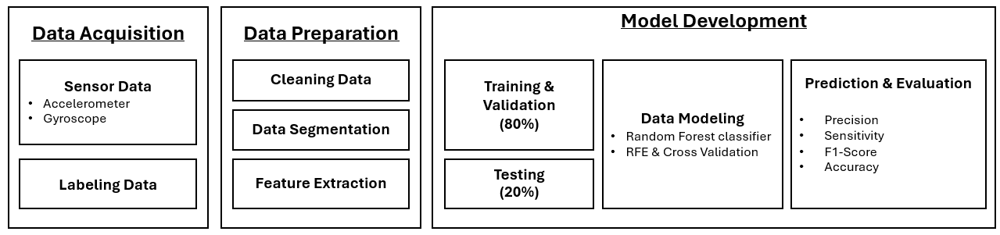

# Process of Individual Dairy Cow Behaviors Classification Using Neck-mounted collar of activity meter.

This repository hosts the data and code for a research project that investigates sensor-based behavior classification in dairy cows. The study focuses on the integration of accelerometer and gyroscope data to classify four key behaviors—**lying**, **standing**, **eating**, and **walking**—at the individual animal level using machine learning.

## Project Objectives
- To evaluate the performance of accelerometer-only, gyroscope-only, and combined sensor models for cow behavior classification.
- To assess behavior-specific and axis-specific signal characteristics using tri-axial motion sensors.
- To apply Random Forest classifiers for individualized model development and performance comparison.

## Introduction
Accurate and automated behavior monitoring is vital for precision livestock farming, enabling early detection of health issues and improved management. While accelerometers are effective for detecting linear motion, gyroscopes provide complementary angular velocity data that can enhance recognition of complex behaviors. This study investigates sensor fusion to improve classification performance and robustness in cow-specific behavioral modeling.

## Sample Dataset Description
- **Subjects:** Holstein-Friesian heifers    
- **Sensors:** MPU-6050 tri-axial accelerometer and gyroscope, mounted on the neck
- **Data Points:** 10-second time windows
- **Labels:** Lying, Standing, Eating, Walking (annotated via synchronized CCTV and ethogram)

## Method Overview
- **Feature Extraction:** 79 features from raw tri-axial accelerometer and gyroscope signals
- **Behavior Annotation:** Manual labeling using video with 0.84 Cohen’s Kappa agreement
- **Modeling Approach:** Random Forest with Recursive Feature Elimination (RFE)
- **Validation:** Stratified 80/20 data split; 10 repeated iterations per individual cow
- **Performance Metrics:** Accuracy, Precision, Sensitivity, and F1-score (macro-averaged)

## Framework of this project


## Repository Structure
```plaintext
data/              # Sample CSV or Excel files with annotated sensor data
code/              # Python scripts for data preprocessing, feature extraction, and model training
                   # R scripts for data analysis, statistical analysis
README.md          # Project description and overview

